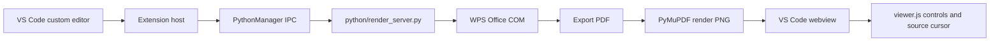

# Development Notes

This document is the maintainer record for DOCX Live Preview. It captures architecture, design decisions, release workflow, testing workflow, and the documentation maintenance rules for future work.

## Documentation Maintenance Rule

At the end of each development conversation, or when work pauses long enough that context may be lost, review and update these three files when relevant:

- `README.md`: user-facing behavior, installation, commands, configuration, and common usage.
- `CHANGELOG.md`: versioned user-visible changes, fixes, packaging changes, and testing notes.
- `DEVELOPMENT.md`: maintainer-facing decisions, workflows, known risks, debugging notes, and release procedures.
- `MEMORY.md` and `memory/`: durable local project memory, current state, decisions, test evidence, and open threads.

The current environment does not expose a persistent automation tool that can edit files after the assistant is no longer active. Treat this section as a standing maintainer protocol: before finalizing substantial work, check whether the project docs and memory files should change.

Before substantial future work, read `MEMORY.md` first, then `memory/project-state.md` and `memory/open-threads.md`. For release or testing work, also read `memory/testing-evidence.md`.

## Project Purpose

DOCX Live Preview provides a VS Code preview editor for `.docx` files that uses WPS Office as the rendering engine. The plugin exists because generic DOCX previewers often diverge from the real WPS layout for academic documents, especially those with OMML equations, CJK fonts, and table-heavy pages.

## Architecture



## Main Components

| Path | Responsibility |
|---|---|
| `src/extension.ts` | Extension activation, command registration, startup `.docx` recovery. |
| `src/docxEditorProvider.ts` | Custom readonly editor lifecycle, renderer orchestration, sync commands, source script discovery. |
| `src/pythonManager.ts` | JSON-line IPC process management for the Python render server. |
| `src/wpsRenderer.ts` | TypeScript wrapper around renderer IPC methods. |
| `python/render_server.py` | WPS COM automation, PDF export, PyMuPDF rendering, bookmark lookup. |
| `media/viewer.js` | Webview UI behavior, zoom, page navigation, transient source cursor, reverse sync messages. |
| `media/styles.css` | Preview styling. |

## Key Design Decisions

| Date | Decision | Reason | Tradeoff |
|---|---|---|---|
| 2026-05-25 | Use WPS COM as the render engine. | WPS output is the layout source of truth for the target documents. | Windows-only and requires WPS installation. |
| 2026-05-25 | Use a Python render server. | Python has mature COM and PyMuPDF support. | Requires Python dependencies and IPC management. |
| 2026-05-25 | Use `_src_L{line}` DOCX bookmarks for source sync. | Simple, deterministic, and compatible with generated DOCX workflows. | Sync is unavailable when bookmarks are absent. |
| 2026-05-25 | Reopen startup `.docx` tabs with the custom editor. | VS Code can initially show the binary editor for command-line-opened DOCX files. | Requires startup activation and a small repair pass. |
| 2026-05-26 | Use transient status bar messages for missing sync/build cases. | Missing mappings should not block reading. | Less prominent than modal notifications. |
| 2026-05-26 | Keep historical VSIX files under `vsix_backups/`. | Keeps release artifacts organized locally. | Directory must remain ignored by git. |
| 2026-05-26 | Render pages on demand instead of pre-rendering the whole document. | Large DOCX files should remain responsive and memory-light. | First visit to an uncached page can take a render round trip. |
| 2026-05-26 | Show source cursors only for explicit source-to-preview jumps. | Default reading should stay clean and unobstructed. | Users do not see every bookmark position at once. |
| 2026-05-26 | Treat startup DOCX tab label recovery as a conservative fallback. | A tab label without a URI can match multiple same-name DOCX files. | Ambiguous matches are skipped instead of guessed. |
| 2026-05-26 | Reset webview page cache whenever the extension sends a refreshed page. | Refresh and auto-refresh must not leave stale non-current pages cached. | The next visit to another page may require a fresh render. |
| 2026-05-26 | Bind preview renderer work to an active session id. | Async WPS/render work can finish after the user has opened another DOCX. | Old work is dropped instead of updating a newer preview. |
| 2026-05-26 | Keep one active DOCX preview renderer per VS Code window. | The Python/WPS render server has one active WPS document at a time. | Opening another DOCX preview replaces the previous active preview. |
| 2026-05-26 | Open WPS documents as read-only and close without saving. | The preview must not contend with user edits in WPS. | Unsaved changes in WPS are not visible until the file is saved. |
| 2026-05-26 | Skip Python health pings while another IPC request is pending. | WPS export/render calls are serialized and can take longer than a ping timeout. | A truly hung long request is detected by that request's own timeout. |
| 2026-05-26 | Attach request ids to page render messages. | Fast page navigation can otherwise let an older page response overwrite the newest page. | Initial progressive page renders remain unnumbered and are accepted only while still relevant. |
| 2026-05-26 | Exclude WPS lock files from VSIX packages. | Local `~$*.docx` files can appear during render tests and should never ship. | `.vscodeignore` must stay aligned with `.gitignore` for transient artifacts. |

## Development Workflow

```powershell
npm install
npm run compile
```

Useful checks:

```powershell
git diff --check
git status --short --ignored
```

## Testing Workflow

Minimum checks before a release:

1. Run `npm run compile`.
2. Run `git diff --check`.
3. Generate or use a DOCX with `_src_L{line}` bookmarks.
4. Verify direct Python renderer behavior when touching WPS/Python code.
5. Verify the VS Code preview in an isolated user-data and extensions directory.
6. Verify default `.docx` opening.
7. Verify zoom controls.
8. Verify preview-to-source reverse sync with `Ctrl` + click.
9. Verify `DOCX: Go to Preview` from a source file.
10. Verify missing mapping/build cases show transient status bar messages.

Latest local regression checks:

- `npm run compile`
- `python -m py_compile python\render_server.py python\check_deps.py`
- `python python\check_deps.py`
- `git diff --check`
- `npx @vscode/vsce ls --no-dependencies`
- `npx @vscode/vsce package --no-dependencies --out %TEMP%\docx-livepreview-<version>-review.vsix`
- Frontend VM check for refresh cache invalidation followed by next-page navigation.
- Frontend VM check for stale page response rejection during fast navigation.
- Direct render server IPC check: `ping`, `open_document`, `render_page`, `get_bookmark_positions`, `close_document`, `shutdown`.
- VS Code extension host check with `@vscode/test-electron`: activate extension, open `docx.docxPreview`, run `DOCX: Refresh Preview`.

Note: `@vscode/test-electron` can emit VS Code host noise such as mutex or worker-load errors in this environment. Treat the DOCX-specific success markers (`preview tab found`, `refresh returned`, `ok: true`) as the plugin smoke-test result, and inspect extension-host logs for DOCX renderer failures.

## Marketplace Verification Workflow

Marketplace updates can lag behind the publisher dashboard. After uploading a VSIX:

```powershell
$root = Join-Path $env:TEMP ('docx-livepreview-marketplace-' + [guid]::NewGuid().ToString('n'))
$ext = Join-Path $root 'extensions'
$user = Join-Path $root 'user-data'
New-Item -ItemType Directory -Force -Path $ext,$user | Out-Null
code --extensions-dir $ext --user-data-dir $user --install-extension docx-chat.docx-livepreview --force
code --extensions-dir $ext --user-data-dir $user --list-extensions --show-versions
```

The expected result for version `0.2.3` is:

```text
docx-chat.docx-livepreview@0.2.3
```

If Marketplace still installs an older version while the dashboard shows `Verifying`, wait for verification and CDN propagation.

## Packaging Workflow

Use a patch version for user-visible bug fixes:

```powershell
npm version patch --no-git-tag-version
npm run compile
npx --yes @vscode/vsce package --out .\vsix_backups\docx-livepreview-x.y.z.vsix
```

Before packaging, ensure `.vscodeignore` excludes:

- source TypeScript files
- sourcemaps
- test artifacts
- local tool configuration
- existing VSIX files
- `e2e_artifacts/`
- `vsix_backups/`

## Release Workflow

1. Update code.
2. Update `README.md`, `CHANGELOG.md`, and `DEVELOPMENT.md` if behavior, packaging, or workflow changed.
3. Bump version in `package.json` and `package-lock.json`.
4. Run `npm run compile`.
5. Run `git diff --check`.
6. Package VSIX into `vsix_backups/`.
7. Commit and push.
8. Upload the VSIX in the Marketplace publisher portal.
9. Wait for `Verifying` to finish.
10. Install from Marketplace into an isolated VS Code profile and confirm the installed version.

## Known Limitations

- Windows-only because WPS COM automation is Windows-only.
- WPS Office must be installed and COM-accessible.
- Python must have `pywin32` and `PyMuPDF`.
- Source sync requires `_src_L{line}` bookmarks inside the DOCX.
- The extension does not automatically run build scripts. This avoids executing user code without explicit intent.
- Marketplace installation can lag behind publisher portal updates.

## Non-goals

- Do not silently execute a build command.
- Do not edit source documents.
- Do not support non-Windows render backends unless a separate renderer abstraction is intentionally designed.
- Do not make missing sync mappings interrupt the reading surface.

## Troubleshooting

### Marketplace still installs an old version

Wait for Marketplace verification and cache propagation. Re-test with a fresh extensions directory.

### Preview opens as a binary editor

The extension contributes a default editor association and performs a startup repair pass for open `.docx` tabs. If this still happens, run `Reopen Editor With...` and choose `WPS DOCX Preview`, then inspect activation and tab restoration behavior.

### Source sync does nothing

Check that the DOCX contains `_src_L{line}` bookmarks. If there is no mapping, the preview remains usable and a transient status bar message is shown.

### Reverse sync cannot open source

Set `docx.sourceScript`, or place a matching build script beside the DOCX:

- `build_generated.py`
- `*_generated.py`
- `build_*.py`

### Renderer fails to start

Check:

- WPS Office installation.
- Python path in `docx.pythonPath`.
- `pywin32` and `PyMuPDF` availability.
- The `DOCX Renderer` output channel.

## Version Snapshot

Current local release target: `0.2.3`.

Latest packaged artifact:

```text
vsix_backups/docx-livepreview-0.2.3.vsix
```
